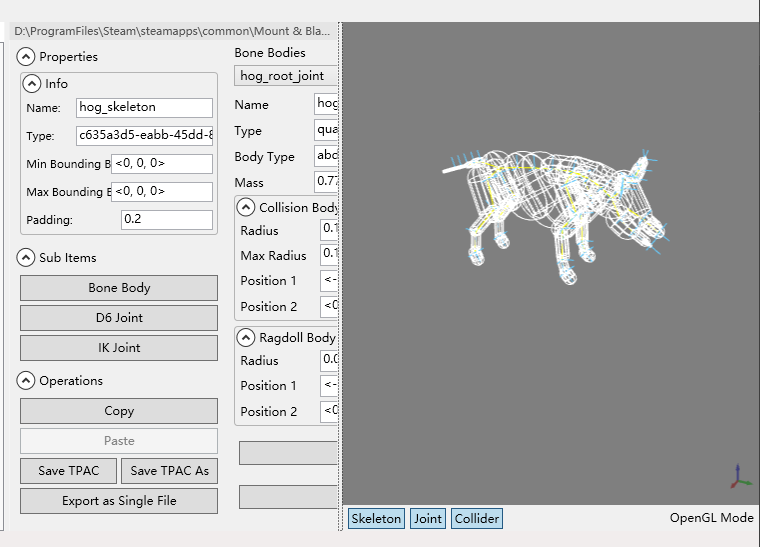
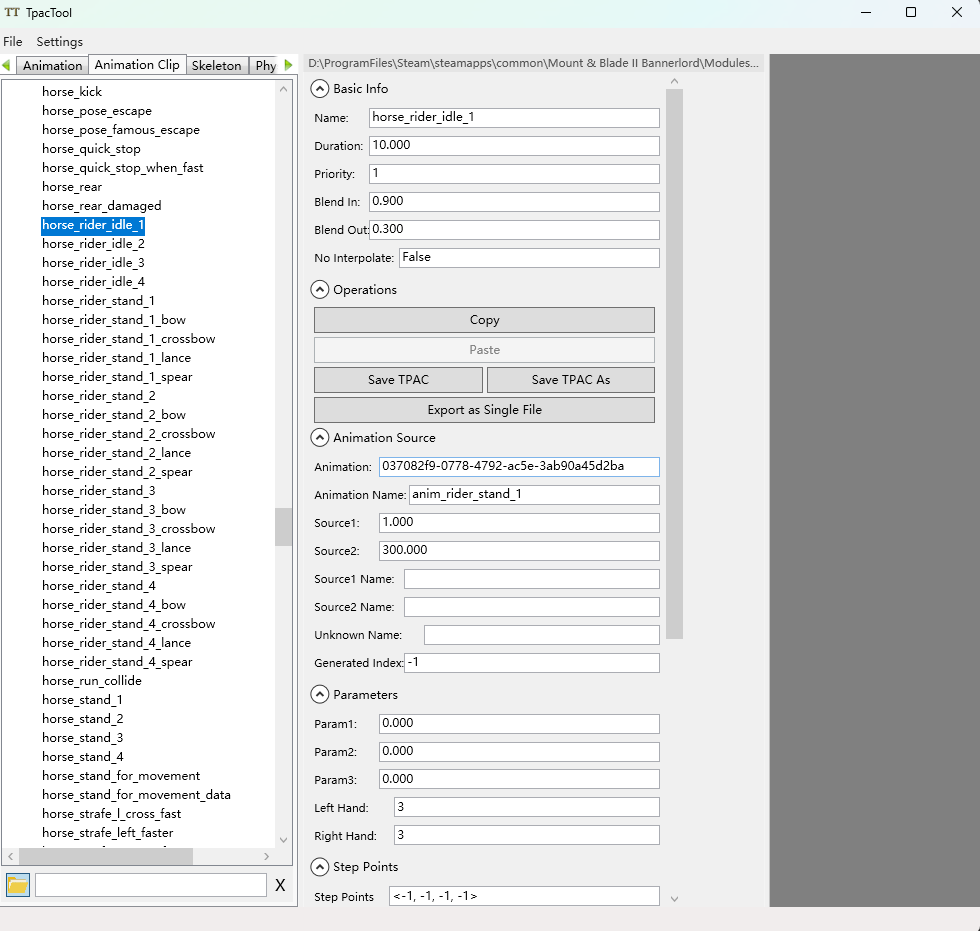

# TpacTool
### Mount&Blade II: Bannerlord 非官方资源浏览器

-------------------

Fork 自 [szszss/TpacTool](https://github.com/szszss/TpacTool)，由 [hunharibo](https://github.com/hunharibo/TpacTool) 维护

-------------------

#### 新增功能

本 Fork 包含以下增强功能：

##### 骨骼可视化
直接在 OpenGL 预览中查看骨骼、关节和碰撞体。可切换骨骼结构、关节和碰撞体的显示。

##### AnimationClip 查看器
浏览和查看 AnimationClip 资源及其详细信息。

##### 单资源导出
将任意单个资源（模型、材质、纹理、骨骼、动画等）直接导出为独立的 .tpac 文件。

#### 许可证

本项目采用 MIT 许可证开源。详见 [LICENSE](LICENSE)。
